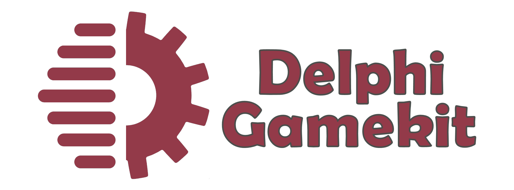

<a href="https://delphigamekit.com" target="_blank"></a>

[](https://discord.gg/tPWjMwK) [](https://github.com/tinyBigGAMES/DelphiGamekit/stargazers) [](https://github.com/tinyBigGAMES/DelphiGamekit/network/members) [](https://github.com/tinyBigGAMES/DelphiGamekit/network/members)
[](https://twitter.com/tinyBigGAMES)

## Overview
DelphiGamekit&trade; is a professional indie game toolkit that allows you to do 2D game development in <a href="https://www.embarcadero.com/products/delphi" target="_blank"> Embarcadero Delphi®</a> for desktop PC's running Microsoft Windows® and uses Direct3D® for hardware accelerated rendering.

It's robust, designed for easy use and suitable for making all types of 2D games and other graphic simulations. You access the features from a simple and intuitive API, to allow you to develop your projects rapidly and efficiently. There is support for textures, audio samples, streaming music, video playback, loading resources directly from a compressed and encrypted archive, a thin object-oriented actor/scene system, collision detection and much more. DelphiGamekit, easy, fast & fun!

Please star this repo by clicking the Star box in the top right corner if you find it useful!

if you wish to learn more about the Delphi language visit <a href="https://learndelphi.org/" target="_blank">learndelphi.org</a>.

## Downloads
<a href="https://github.com/tinyBigGAMES/DelphiGamekit/archive/refs/heads/main.zip" target="_blank">**Development**</a> - This build represents the most recent development state an as such may or may not be as stable as the official release versions. If you like living on the bleeding edge, it's updated frequently (often daily) and will contain bug fixes and new features.

<a href="https://github.com/tinyBigGAMES/DelphiGamekit/releases" target="_blank">**Releases**</a> - These are the official release versions and deemed to be the most stable.

<a href="https://tinybiggames.com/temp/DelphiGamekit_Examples.zip" target="_blank">**Examples**</a> - These are compiled examples (win64).

## Features
- **Free** and open-source. See <a href="https://github.com/tinyBigGAMES/DelphiGamekit/blob/main/LICENSE" target="_blank">License agreement</a>.
- Written in **Object Pascal**
- Support Windows 64 bit platform
- Hardware accelerated with **Direct3D**
- You interact with DelphiGamekit via your derived `TGame` class and the various classes and routines in the `DelphiGamekit` unit.
- **Archive** (custom archive format, password protected)
- **Window** (Direct3D, primitives, blending)
- **Input** (keyboard, mouse and game controller)
- **Texture** (color key transparency, scaling, rotation, flipped, tiled, JPEG, PNG)
- **Video** (play, pause, rewind, MPEG-1 format)
- **Audio** (samples, streams, OGG/Vorbis formats)
- **Font** (true type, scale, can render using vertex buffer)
- **Math** (point, vector, rect and other useful routines for 2D graphics)
- **Timing** (time-based, frame elapsed, frame speed)
- **Speech** (text-to-speech, change speed, pitch, select different voices)
- **Screenshake** (you can set duration and magnitude, they are accumulative)
- **Async** (push a task to run in the background, and optionally run a forground task after background task completes)
- **CloudDb** (access remote MySQL database using HTTP and PHP)
- **Sprite** (animated texture images organized into pages and groups)
- **Entity** (sprite objects, that has position, color, can be scaled and rotated)
- **Actor** (high level game object that can persist in the game world)
- **ActorScene** (multiple layers that actors exist on in the game world)
- **ConfigFile** (INI based configuration file management)
- **Scripting** (LuaJIT, easy interop between Lua and Delphi,  register variables, routines, etc.)
- **In App Purchase** (easily do in app purchase directly within app, powered by Stripe.com)
- **Misc** (collision, easing, screenshot, colors, logging and other useful utility routines)
- And more. See `DelphiGamekit.pas` in `installdir\sources` and the docs in `installdir\docs` for more information about features.

## Minimum System Requirements
- Delphi 10.4, Win64 platform
- Microsoft Windows 10, 64 bits
- Direct3D 9

**Note: The minimum system requirements stated are necessary to use the library.**

## Sponsor Benefits 
- The Software may be used by an unlimited number of developers to develop an unlimited number of commercial Products, which may be distributed to an unlimited number of clients, with no distribution or usage restrictions. 
- You will have priority support with access to our private DelphiGamekit development forum and discord channel.
- You will have access to private betas, documents, etc. and be able to help shape the direction of the product.
- You will be helping us continue developing this product, thank you in advance.

## Other ways to help
- I will make some examples and demos using this project.
- I will spread the word about this project.
- I wish to do X for this project.

Thank you very much for any support you can provide, I will be most grateful. :clap: 

## How to use in Delphi
- Unzip the archive to a desired location.
- Add `installdir\sources`, folder to Delphi's library path so the library source files can be found for any project or for a specific project add to its search path.
- Use `DGTools` utility for making archive files (compressed, encrypted custom format), converting video/audio to a compatible format. Running the `dgt_arc.bat` in `installdir\bin` will build `Data.arc` that is used by the examples. You can use `dgt_video.bat` and `dgt_audio.bat` for video/audio conversion. **DGTools** uses **FFmpeg** to do the actual conversion. Download and place `FFmpeg.exe` in the same location as `DGTools.exe`. See `installdir\bin\ffmpeg.txt`.
- In Delphi, load `DelphiGamekit.groupproj` to load and compile the examples/demos/tools, which will showcase the toolkit features and how to use them.
- See examples in the `installdir\examples` folder for more information about usage.
- See `installdir\docs` folder for documentation.

## Known Issues
- This project is in active development so changes will be frequent 
- Documentation is WIP. They will continue to evolve
- More examples will continually be added over time

## A Tour of DelphiGamekit
### Game Object
You just have to derive a new class from the `TGame` base class and override a few callback methods. You access the toolkit functionality from the `DelphiGamekit` unit.
```pascal
uses
  DelphiGamekit;

type
  { TMyGame }
  TMyGame = class(TGame)
  public
    procedure OnSetSettings; override;
    procedure OnStartup; override;
    procedure OnShutdown; override;
    procedure OnUpdate(aDeltaTime: Double); override;
    procedure OnRender; override;
    procedure OnRendeHUD; override;
  end;
```
### How to use
A minimal implementation example:
```pascal

{ TMyGame }
procedure TMyGame.OnSetSettings;
begin
  inherited;
  
  // add your settings code  
  aSettings.WindowWidth := 960;
  aSettings.WindowHeight := 540;
  aSettings.WindowTitle := 'My Game';
  aSettings.WindowClearColor := DARKSLATEBROWN;  
end;

procedure TMyGame.OnStartup;
begin
  inherited;
  
  // add your own startup code
end;

procedure TMyGame.OnShutdown;
begin
  // add your shutdown code
  
  inherited;
end;

procedure TMyGame.OnUpdate(aDeltaTime: Double);
begin
  inherited;
  
  // add your update code
end;

procedure TMyGame.OnRender;
begin
  inherited;
  
  // render your render code
end;

procedure TMyGame.OnRenderHUD;
begin
  inherited;
  
  // add your render HUD code 
end;
```
To run your game, call
```pascal
RunGame(TMyGame);
```
**NOTE:** For a DelphiGamekit game to work properly, execution MUST start with `RunGame(...)`. Only a single instance will be allowed to run, all other instances will quietly terminate.

See the examples for more information on usage.

## Media
DelphiGamekit Intro  

https://user-images.githubusercontent.com/69952438/204374762-60d86003-baf3-46a0-9523-2959837be456.mp4

## Support
Our development motto: 
- We will not release products that are buggy, incomplete, adding new features over not fixing underlying issues.
- We will strive to fix issues found with our products in a timely manner.
- We will maintain an attitude of quality over quantity for our products.
- We will establish a great rapport with users/customers, with communication, transparency and respect, always encouraging feedback to help shape the direction of our products.
- We will be decent, fair, remain humble and committed to the craft.

## Links:
- <a href="https://delphigamekit.com" target="_blank">Website</a>
- <a href="mailto:support@tinybiggames.com" target="_blank">Email</a>
- <a href="https://github.com/tinyBigGAMES/DelphiGamekit/discussions" target="_blank">Discussions</a>
- <a href="https://github.com/tinyBigGAMES/DelphiGamekit/issues" target="_blank">Issue Tracking</a>
- <a href="https://facebook.com/groups/delphigamekit" target="_blank">Facebook Group</a>
- <a href="https://twitter.com/tinyBigGAMES" target="_blank">Twitter </a>
- <a href="https://discord.gg/S6A5XymrYa" target="_blank">Discord</a> (#delphigamekit)
- <a href="https://youtube.com/tinyBigGAMES" target="_blank">YouTube</a>

<p align="center">
 <a href="https://www.embarcadero.com/products/delphi" target="_blank"></a><br/>
 ♥ <b>Made for Delphi</b>
</p>


